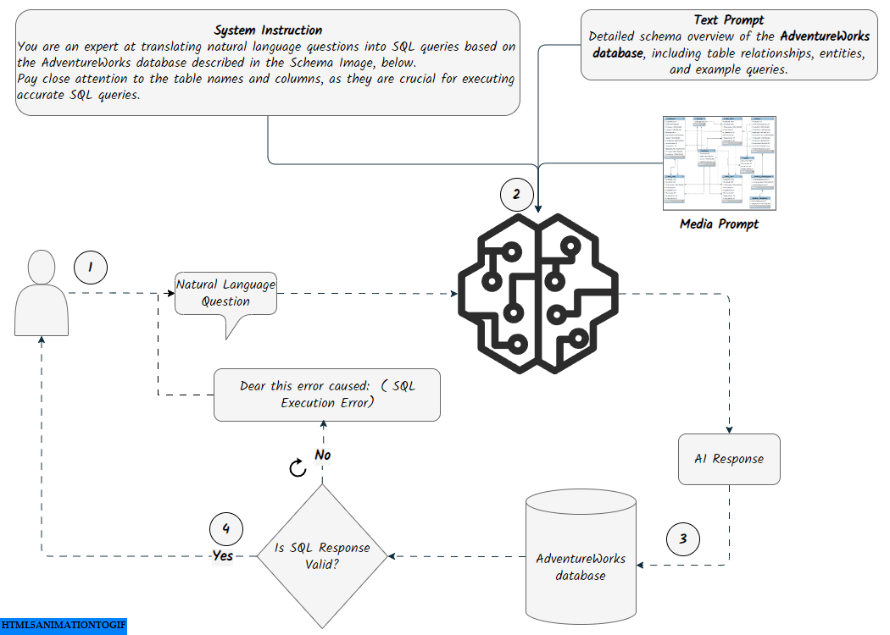

# Adventureworks Database

This repository is for setting up a relational MySQL database in Python, building a Text-to-SQL Streamlit app that translates plain language questions into SQL queries, and executing those SQL queries on the database to retrieve results.

<p align= "center">

</p>

<div style="display: flex; justify-content: space-around;">
    
    
</div>

## How to setup the database?

In this [blog](https://ahmedsalim3.github.io/posts/adventureworks-database/), I cover the steps to create the database and convert it into SQLite. The [rdbms](./rdbms/) folder contains the code for this process. Refer to [TODO](./rdbms/TODO.md) for more details.

## Installation

1. **Clone this repository:**

  ```bash
  git clone https://github.com/ahmedsalim3/AdventureWorks-Database.git
  ```

2. **Navigate to the repository directory:**

  ```bash
  cd AdventureWorks-Database
  ```

3. **Create a Virtual Environment (Recommended):**

  ```bash
  python -m venv env
  .\env\Scripts\activate  # On Windows
  source env/bin/activate  # On macOS/Linux
  ```

4. **Install Requirements:**

  ```bash
  pip install -r requirements.txt
  ```

## Create Database

- Navigate to `rdbms` and make sure to configure your database at [csv2mysql.py](./rdbms/csv2mysql.py#L69-L75), follow [TODO](./rdbms/TODO.md) file for more details

    ```bash
    cd rdbms
    python csv2mysql.py 
    ```

## Run the App

- From the root directory, run this:
    
    ```bash
    python -m streamlit run app/app.py
    ```

## Install via DockFile

  ```
  docker build -t image_name .

  docker run -p 8501:8501 image_name
  ```

## Repo's directory structure

```sh
.
├── app                             <- Text-To-SQL Streamlit app
│   ├── README.md
│   ├── _pages
│   │   ├── prompt_page.py
│   │   ├── rag_page.py
│   │   └── utils.py
│   ├── rag
│   │   ├── documents.py
│   │   └── vector_db.py
│   ├── app.py
│   ├── config.py
│   ├── constants.py
│   ├── prompting_text_to_sql.py
│   ├── rag_text_to_sql.py
│   ├── requirements.txt
│   └── ui
│ 
├── data                            <- Data source
│ 
├── rdbms                           <- Relational Database Management System
│   ├── TODO.md
│   ├── __init__.py
│   ├── adventureworks.db
│   ├── adventureworks_schema.png
│   ├── assets
│   ├── csv2mysql.py
│   ├── install_mysql_linux.md
│   ├── mysql2sqlite
│   ├── schema.sql
│   └── utils.py
│ 
├── LICENSE
├── README.md
├── Dockerfile
└── requirements.txt

```
