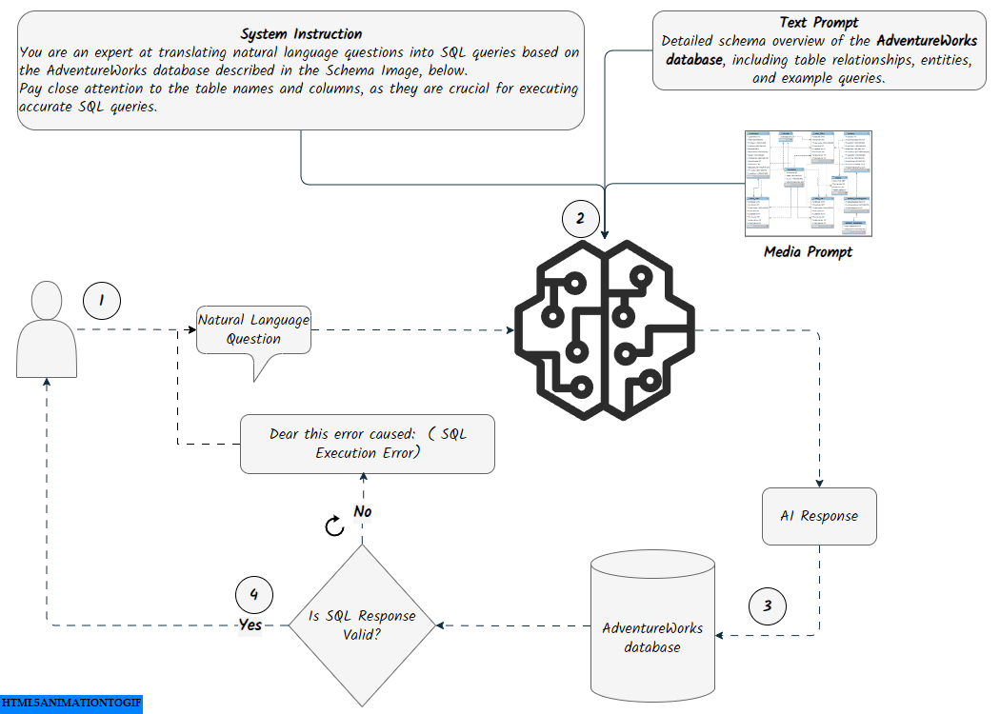
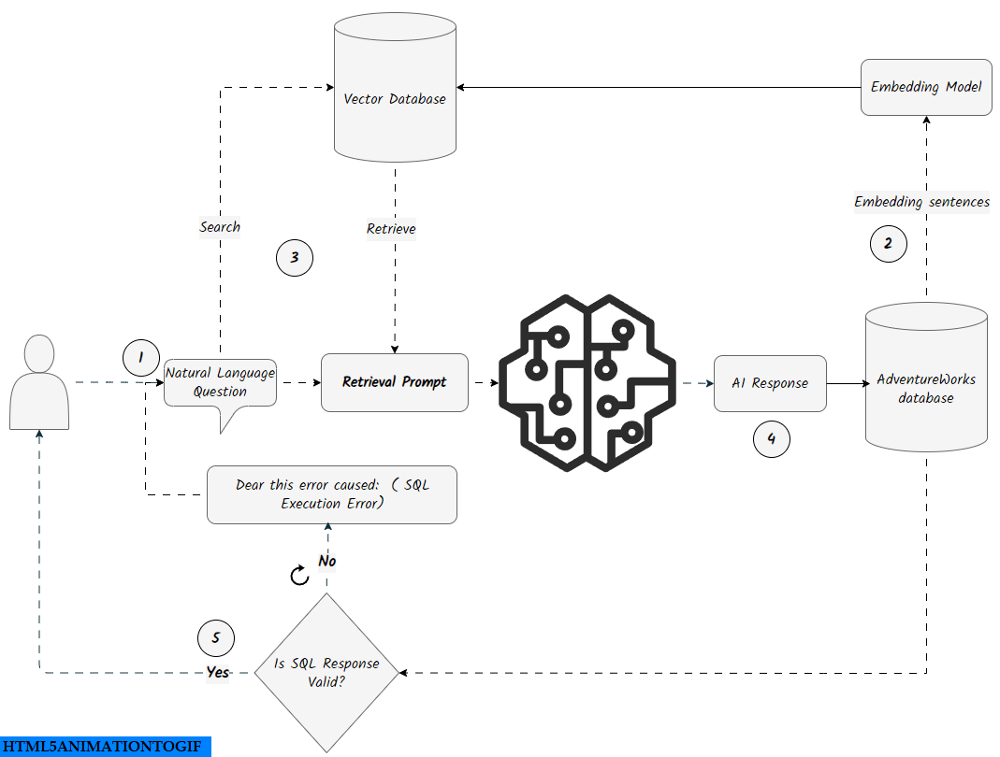

# Text-to-SQL App with Gemini 1.5 Flash

This fle contains a Streamlit application for generating and executing SQL queries using the Google Gemini API. The application interacts with a SQLite database populated with AdventureWorks sample data

<p align= "center">

</p>

<div align="center">
  
[[`Blog`](https://ahmedsalim3.github.io/posts/text-to-sql)] [[`Dataset`](https://www.kaggle.com/datasets/ukveteran/adventure-works)] [`Schema`](https://ahmedsalim3.github.io/posts/adventureworks-database/#entity-relationship-diagram-erd) [[`Streamlit App`](https://ai-sql.streamlit.app/)]
<div style="display: flex; justify-content: space-around;">
    
    
</div>

</div>

## Features
- SQL Generation: Utilizes the Google Gemini API to translate natural language questions into SQL queries (SQLite)
- Database Connectivity: Executes generated SQL queries on the AdventureWorks SQLite database
- Streamlit Interface: Provides a user-friendly web interface for inputting questions and displaying query results

## Installation

1. **Clone this repository:**

  ```bash
  git clone https://github.com/ahmedsalim3/AdventureWorks-Database.git
  ```

2. **Navigate to the repository directory:**

  ```bash
  cd AdventureWorks-Database/app
  ```

3. **Create a Virtual Environment (Recommended):**

  ```bash
  python -m venv env
  .\env\Scripts\activate  # On Windows
  source env/bin/activate  # On macOS/Linux
  ```

4. **Install Requirements:**

  ```bash
  pip install -r requirements.txt
  ```

5. **Create a new [Gemini API](https://aistudio.google.com/app/apikey) and place it in a [config.py](https://github.com/ahmedsalim3/AdventureWorks-Database/blob/6b06f38f9c4a191edc41857312b4654617d6cfd3/app/config.py#L16) file:**

  ```bash
  API_KEY = os.getenv("GOOGLE_API_KEY")
  # comment this line as it's used for deployement, it access the api key through streamlit secrets
  # API_KEY = st.secrets["GOOGLE_API_KEY"]
  ```

6. **Run the Streamlit application:**

- From the [root](../) directory, run this:
    
    ```bash
    python -m streamlit run app/app.py
    ```

## Install via DockFile

    ```sh
    docker build -t image_name .

    docker run -p 8501:8501 image_name
    ```